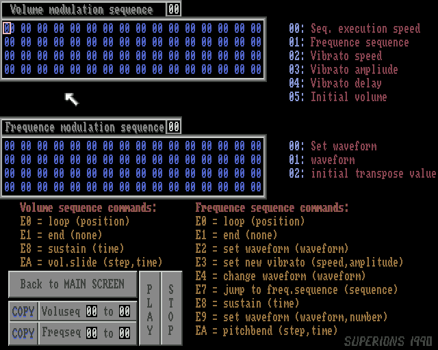

### More about the FC/HIP TFMX decoder in this library

Originally, this library had started as a portable C API to an old and
stable ``Future Composer`` music player that has been used in several plug-ins
for versatile audio players like XMMS, BMP, Audacious, GStreamer and
others on various platforms. No list is known.

Availability of a native FC decoder has served the community of chiptune
music enthusiasts in more than one way. Providing a convenient and
reliable method to listen to memorable music in FC format has been the
primary goal.

Whereas some guys have converted their personal chiptune collections to
MP3 (or other formats) eventually, the majority seems to prefer the
original files together with a solution to listen to them. An emulator as
a last resort. 

This library has also contributed to the hunt for truly
invalid, damaged or dubious FC music files in module collections. The
early code included several workarounds and safety measures already.
Newly discovered defects in FC files could be fixed and documented within
the player library. In a few cases, FC files have been broken for over 30
years because they had been converted incorrectly from TFMX format. Such
as the soundtrack from the game ``Chambers of Shaolin''. Repaired files
have been uploaded to https://modland.com as one of the primary sources
of files that have been used for testing.

### Future Composer & TFMX

Future Composer on AMIGA was based on a machine code music player by
Jochen Hippel that used his TFMX data format (not to be confused with the
other TFMX by Chris Hülsbeck which expands to ``The Final Musicsystem eXtended``
and is vastly different, but both guys have known each other. There have been
interviews with both confirming that Hippel's 7 Voices mode was adapted by
Hülsbeck. But has an interviewer ever asked about using the same TFMX acronym
for two vastly different music player systems?

As a machine code programmer and pioneer of computer music, the features
of Jochen Hippel's music player enabled him to create a unique chiptune
sound that could hardly be recreated with the early publicly available
Soundtracker programs. Just like he had been inspired by Commodore 64 SID
music, his own game soundtracks created during the golden era of chiptune
music have inspired more than one generation of music composers and
remixers around the world. Even after decades new remixes get published.
See, for example, http://www.amigaremix.com and http://remix64.com as a hub.

Future Composer, apart from a few incompatible changes to the TFMX file
format and player code, and with its publicly released editor as the most
important feature and biggest achievement, was not just "based on" Hippel's
TFMX player, it was a ripoff! After just a few changes to the file format
loader, this FC library could almost play basic TFMX files found in major
module collections.

However, innovative as TFMX has been during its era, at the same time it
was subject to steady development, and thus its feature set and player
implementation details changed more than once, which lead to several
incompatibilities and intricacies. No single machine code player remained
compatible with previously released music module data. With a second format
(COSO = compressed songs) and a 7 Voices enhancement increasing diversity
even further.

As one common solution to the problem, only with a matching pair of music
file and its specific machine code player you could use that in an
emulator, possibly a music player using sort sort of emulator engine as a
backend. For convenience, often but not always, the machine code player is
stored at the beginning of the music module file. Where the machine code
player is unavailable, figuring out which specific player features are
needed becomes tricky. Where all means of file content detection fail,
a database of checksums could be relied on as a last resort.

Just as it's been done with the support for FC, this library implements
native support for the TFMX/Hippel family of music files.

If you encounter unexpected behaviour or files that sound incorrect,
please open a ticket at the following place:
https://github.com/mschwendt/libtfmxaudiodecoder/issues

The terminology used in each source file differs from the documentation
that comes with the Future Composer editor. For instance, the ``pattern
SEQUENCER`` is called ``track table`` to not conflict with real pattern
administration variables and not with the ``modulation sequence`` features
either. The ``FREQUENCE-Modulation`` sequence is called ``sound
modulation`` sequence because it does not only affect the sample period,
but also the currently active sample. Also, the ``VOLUME-Modulation``
sequence actually defines an instrument and contains parameters which not
only affect volume. It better ought to be called ``instrument definition``
sequence. However, once the instrument has been defined, the rest of the
sequence does only do the volume envelope.

### Supported versions of Future Composer

Future Composer v1.0 to 1.3 (SMOD)  (C) 1989 The Superions  
Future Composer v1.4 (FC14)  (C) 1990 by Supersero of The Superions  

Future Composer is based on the TFMX music player by Jochen Hippel.
Most likely the one used in the AMIGA games "Astaroth: The Angel of Death"
and "Chambers of Shaolin".

Screen-shots of Future Composer v1.4 main screen, pattern editor, and sound editor:

